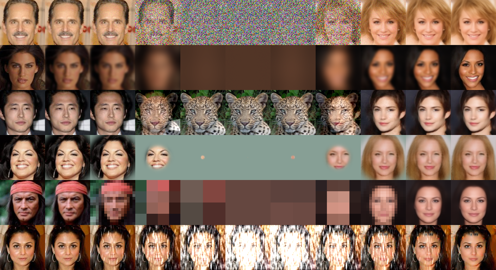

# Cold Diffusion: Inverting Arbitrary Image Transforms Without Noise
</img>

The official PyTorch implementation of <a href="https://arxiv.org/abs/2208.09392">Cold-Diffusion</a>. Developed collaboratively by Arpit Bansal, Eitan Borgnia, Hong-Min Chu, Jie Li, and Hamid Kazemi, all at the University of Maryland. This repository has code to train and test various cold diffusion models based on the following image degradations: Gaussian blur, Gaussian mask, resolution downsampling, color desaturation, image snow, and _animorphosis_. Our implementation is based on the denoising diffusion repository from <a href="https://github.com/lucidrains/denoising-diffusion-pytorch">lucidrains</a>, which is a PyTorch implementation of <a href="https://arxiv.org/abs/2006.11239">DDPM</a>.

## Citing Our Work

To cite our paper please use the following bibtex entry.

```bibtex
@misc{bansal2022cold,
      title={Cold Diffusion: Inverting Arbitrary Image Transforms Without Noise}, 
      author={Arpit Bansal and Eitan Borgnia and Hong-Min Chu and Jie S. Li and Hamid Kazemi and Furong Huang and Micah Goldblum and Jonas Geiping and Tom Goldstein},
      year={2022},
      eprint={2208.09392},
      archivePrefix={arXiv},
      primaryClass={cs.CV}
}
```

## Preparing the Datasets

We use the `create_data.py` file to split data into individual folders for training and testing data. The MNIST and CIFAR-10 datasets can be processed directly with `create_data.py,` but a path to the folder for the CelebA dataset is required. The AFHQ dataset is already split up into individual folders for training and testing data, so preprocessing is unecessary. The save directory for each of the data folders can be modified and will be used in the training scripts for the various hot/cold diffusion models.

## Denoising (traditional DDPM)

#### Training 
```
cd denoising-diffusion-pytorch
python celebA_noise_128.py --time_steps 200 --sampling_routine x0_step_down --save_folder <Path to save model> --data_path <Path to data folder>
python AFHQ_noise_128.py --time_steps 200 --sampling_routine x0_step_down --save_folder <Path to save model> --data_path <Path to data folder>
```

sampling_routine with estimated noise
```
python celebA_noise_128_test.py --time_steps 200 --sampling_routine ddim --save_folder <Path to save images> --load_path <Path to load model> --data_path <Path to data folder> --test_type test_sample_and_save_for_fid
python AFHQ_noise_128_test.py --time_steps 200 --sampling_routine ddim --save_folder <Path to save images> --load_path <Path to load model> --data_path <Path to data folder> --test_type test_sample_and_save_for_fid
```

sampling_routine with fixed noise
```
python celebA_noise_128_test.py --time_steps 200 --sampling_routine x0_step_down --save_folder <Path to save images> --load_path <Path to load model> --data_path <Path to data folder> --test_type test_sample_and_save_for_fid
python AFHQ_noise_128_test.py --time_steps 200 --sampling_routine x0_step_down --save_folder <Path to save images> --load_path <Path to load model> --data_path <Path to data folder> --test_type test_sample_and_save_for_fid
```

## Deblur

```
cd deblurring-diffusion-pytorch
```

#### Transformation
Training
```
python mnist_train.py --time_steps 20 --blur_size 11 --blur_std 7.0 --blur_routine 'Constant' --sampling_routine x0_step_down --data_path <Path to data folder> --save_folder <Path to save model> 
python cifar10_train.py --time_steps 50 --blur_routine 'Special_6_routine' --sampling_routine x0_step_down --data_path <Path to data folder> --save_folder <Path to save model> 
python celebA_128.py --time_steps 200 --blur_size 15 --blur_std 0.01 --blur_routine Exponential_reflect --sampling_routine x0_step_down --data_path <Path to data folder> --save_folder <Path to save model> 
```

Testing
```
python mnist_test.py --time_steps 20 --blur_size 11 --blur_std 7.0 --blur_routine 'Constant' --sampling_routine 'x0_step_down' --save_folder <Path to save results> --data_path <Path to data folder> --test_type test_data
python cifar10_test.py --time_steps 50 --blur_routine 'Special_6_routine' --sampling_routine 'x0_step_down' --save_folder <Path to save results> --data_path <Path to data folder> --test_type test_data
python celebA_128_test.py --time_steps 200 --blur_size 15 --blur_std 0.01 --blur_routine Exponential_reflect --sampling_routine x0_step_down --save_folder <Path to save results> --data_path <Path to data folder> --test_type test_data
```

#### Generation

Training
```
python celebA_128.py --discrete --time_steps 300 --blur_size 27 --blur_std 0.01 --blur_routine Exponential --sampling_routine x0_step_down --data_path <Path to data folder> --save_folder <Path to save models>
python AFHQ_128.py --discrete --time_steps 300 --blur_size 27 --blur_std 0.01 --blur_routine Exponential --sampling_routine x0_step_down --data_path <Path to data folder> --save_folder <Path to save models>
```

Sampling with Perfect Symmetry
```
python celebA_128_test.py --gmm_cluster 1 --noise 0.000 --discrete --time_steps 300 --blur_size 27 --blur_std 0.01 --blur_routine Exponential --sampling_routine x0_step_down --save_folder <Path to save results> --load_path <Path to load models> --data_path <Path to data folder> --test_type train_distribution_mean_blur_torch_gmm_ablation
python AFHQ_128_test.py --gmm_cluster 1 --noise 0.000 --discrete --time_steps 300 --blur_size 27 --blur_std 0.01 --blur_routine Exponential --sampling_routine x0_step_down --save_folder <Path to save results> --load_path <Path to load models> --data_path <Path to data folder> --test_type train_distribution_mean_blur_torch_gmm_ablation
```


## Animorph

#### Generation

Training
```
cd demixing-diffusion-pytorch
python AFHQ_128_to_celebA_128.py --time_steps 200 --sampling_routine x0_step_down --save_folder <path to save models> --data_path_start <Path to starting data manifold> --data_path_end <Path to ending data manifold>
```
Sampling
```
python AFHQ_128_to_celebA_128_test.py --time_steps 200 --sampling_routine x0_step_down --save_folder <Path to save images> --load_path <Path to load model> --data_path_start <Path to starting data manifold> --data_path_end <Path to ending data manifold> --test_type test_sample_and_save_for_fid
```

## Inpaint

#### Transformation
Training
```
cd defading-diffusion-pytorch
python mnist_train.py --time_steps 50 --save_folder <path to save models> --discrete --sampling_routine x0_step_down --train_steps 700000 --blur_std 0.1 --fade_routine Random_Incremental --data_path <Path to data folder>
python cifar10_train.py --time_steps 50 --save_folder <path to save models> --discrete --sampling_routine x0_step_down --train_steps 700000 --blur_std 0.1 --fade_routine Random_Incremental --data_path <Path to data folder>
python celebA_train.py --time_steps 100 --fade_routine Incremental --save_folder <path to save models> --sampling_routine x0_step_down --train_steps 350000 --kernel_std 0.2 --initial_mask 1 --image_size 128 --dataset celebA --data_path <Path to data folder>
```

Testing
```
python mnist_test.py --time_steps 50 --save_folder test_mnist --discrete --sampling_routine x0_step_down --kernel_std 0.1 --initial_mask 1 --image_size 28 --fade_routine Random_Incremental --load_path <Path to load model> --data_path <Path to data folder> --test_type test_data 
python cifar10_test.py --time_steps 50 --save_folder test_cifar10 --discrete --sampling_routine x0_step_down --kernel_std 0.1 --initial_mask 1 --image_size 32 --fade_routine Random_Incremental --load_path <Path to load model> --data_path <Path to data folder> --test_type test_data
python celebA_test.py --time_steps 100 --fade_routine Incremental --save_folder test_celebA --sampling_routine x0_step_down --kernel_std 0.2 --initial_mask 1 --image_size 128 --dataset celebA --load_path <Path to load model> --data_path <Path to data folder> --test_type test_data
```

#### Generation

Training
```
cd defading-generation-diffusion-pytorch
python celebA_128.py --reverse --kernel_std 0.05 --initial_mask 1 --time_steps 750 --sampling_routine x0_step_down --save_folder <Path to save models> --data_path <Path to data folder>
```

Sampling
```
python celebA_constant_128_test.py --noise 0 --reverse --kernel_std 0.05 --initial_mask 1 --time_steps 750 --sampling_routine x0_step_down --save_folder <Path to save images> --data_path <Path to data folder> --load_path <Path to load model> --test_type test_sample_and_save_for_fid
```


## Super-Resolution

Training
```
cd resolution-diffusion-pytorch
python mnist_train.py --time_steps 3 --resolution_routine 'Incremental_factor_2' --save_folder <Path to save models>
python cifar10_train.py --time_steps 3 --resolution_routine 'Incremental_factor_2' --save_folder <Path to save models>
python celebA_128.py --time_steps 4 --resolution_routine 'Incremental_factor_2' --save_folder <Path to save models>
```

Testing
```
python mnist_test.py --time_steps 3 --train_routine 'Final' --sampling_routine 'x0_step_down' --resolution_routine 'Incremental_factor_2' --save_folder <Path to save images> --load_path <Path to load model> --test_type test_data
python cifar10_test.py --time_steps 3 --train_routine 'Final' --sampling_routine 'x0_step_down' --resolution_routine 'Incremental_factor_2' --save_folder <Path to save images> --load_path <Path to load model> --test_type test_data
python celebA_test.py --time_steps 4 --train_routine 'Final' --sampling_routine 'x0_step_down' --resolution_routine 'Incremental_factor_2' --save_folder <Path to save images> --load_path <Path to load model> --test_type test_data
```

#### Generation
```
python celebA_test.py --time_steps 4 --train_routine 'Final' --sampling_routine 'x0_step_down' --resolution_routine 'Incremental_factor_2' --save_folder <Path to save images> --load_path <Path to load model> --test_type test_data
```

## Snowify

```
cd snowification
```

Training
```
python train.py --dataset cifar10 --time_steps 200 --forward_process_type ‘Snow’ --snow_level 3 --exp_name <exp_name>  --dataset_folder <path-to-dataset> --random_snow --fix_brightness  --sampling_routine x0_step_down
python train.py --dataset celebA --time_steps 200 --forward_process_type ‘Snow’ --snow_level 4 --exp_name <exp_name> --dataset_folder <path-to-dataset> --random_snow --fix_brightness  --sampling_routine x0_step_down
```

Testing
```
python test.py --dataset cifar10 --time_steps 200 --forward_process_type ‘Snow’ --snow_level 3 --exp_name <exp_name> --dataset_folder <path-to-dataset> --random_snow --fix_brightness --resume_training --sampling_routine x0_step_down --test_type test_data --order_seed 1
python test.py --dataset celebA --time_steps 200 --forward_process_type ‘Snow’ --snow_level 4 --exp_name <exp_name> --dataset_folder <path-to-dataset> --random_snow --fix_brightness --resume_training --sampling_routine x0_step_down --test_type test_data --order_seed 1
```

## Colorization

```
cd decolor-diffusion
```

Training
```
python train.py --dataset cifar10 --time_steps 20 --forward_process_type ‘Decolorization’ --exp_name <exp_name> --decolor_total_remove --decolor_routine ‘Linear’ --dataset_folder <path-to-dataset>
python train.py --dataset celebA --time_steps 20 --forward_process_type ‘Decolorization’ --exp_name <exp_name> --decolor_total_remove --decolor_routine ‘Linear’ --dataset_folder <path-to-dataset>
```

Testing
```
python test.py --dataset cifar10 --time_steps 20 --forward_process_type ‘Decolorization’ --exp_name <exp-name>  --decolor_total_remove --decolor_routine ‘Linear’ --dataset_folder <path-to-dataset> --sampling_routine x0_step_down --test_type test_data --order_seed 1
python test.py --dataset celebA --time_steps 20 --forward_process_type ‘Decolorization’ --exp_name <exp-name>  --decolor_total_remove --decolor_routine ‘Linear’ --dataset_folder <path-to-dataset> --sampling_routine x0_step_down --test_type test_data --order_seed 1
```
